

<h1>🚗 Rihla - Transportation Analytics Platform</h1>

  

  
  
  
  
  
  

  
  
  
  

## 🎯 Project Overview

> **Revolutionizing Transportation Through Data Analytics** 🌟

This project represents a **comprehensive end-to-end data analytics solution** for Rihla, a multi-service transportation platform similar to Uber. We've built a complete ecosystem that handles three core services: **ride-hailing**, **freight logistics**, and **vehicle rentals** - transforming raw operational data into actionable business intelligence.

### 💰 Business Impact at a Glance

| Metric | Value | Description |
|--------|-------|-------------|
| 💵 **Total Revenue** | $40.3M | Combined revenue across all services |
| 📈 **Net Profit** | $9.07M | Overall profitability |
| 📊 **Profit Margin** | 26.27% | Healthy profit margin |
| 🚖 **Total Trips** | 20K | Completed ride-hailing trips |
| 👥 **Active Customers** | 10K | Registered active users |

---

  
*Here is some screenshots of our powerful +20 dashboards*

<!-- ADD YOUR SCREENSHOTS HERE -->
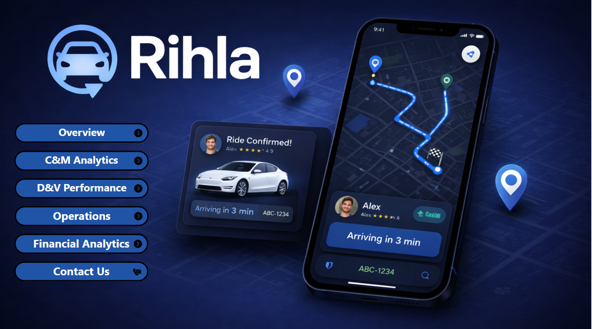
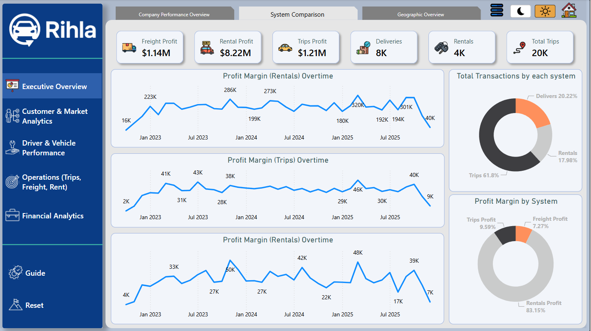
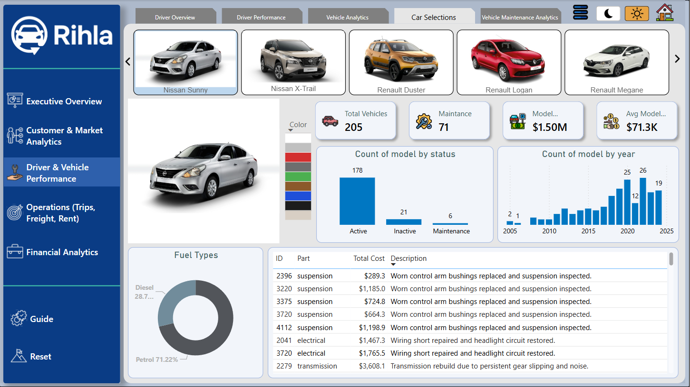

---

## 🏗️ System Architecture & Workflow

### Our End-to-End Data Pipeline

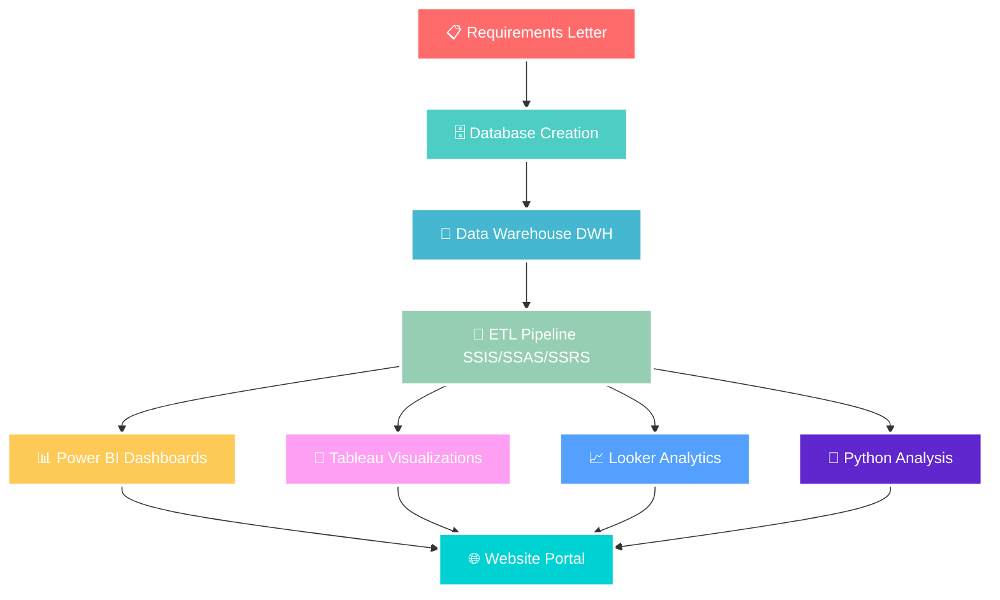

---

## 🚀 Core Services

| Service | Description | Key Metrics |
|---------|-------------|-------------|
| 🚖 **Trips** | Core ride-hailing service with real-time tracking, dynamic pricing, and secure payments | 20K trips • $4.68M revenue • $1.21M profit |
| 📦 **Freight** | On-demand freight transportation for goods and packages with tracking | 8K deliveries • $4.34M revenue • $1.14M profit |
| 🚙 **Rent** | Short-term and long-term vehicle rentals with flexible pickup locations | 4K rentals • $31.24M revenue • $8.22M profit |

---

## 📊 Database Design & ERD

### 🗺️ Entity Relationship Diagram

Our database consists of **14 core entities** with carefully designed relationships to ensure data integrity and optimal query performance.

## ERD
<!-- ADD YOUR ERD SCREENSHOT HERE -->
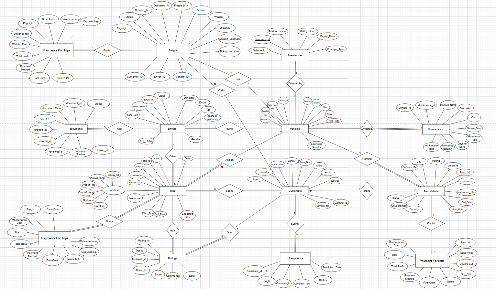

## Mapping
<!-- ADD YOUR MAPPING SCREENSHOT HERE -->
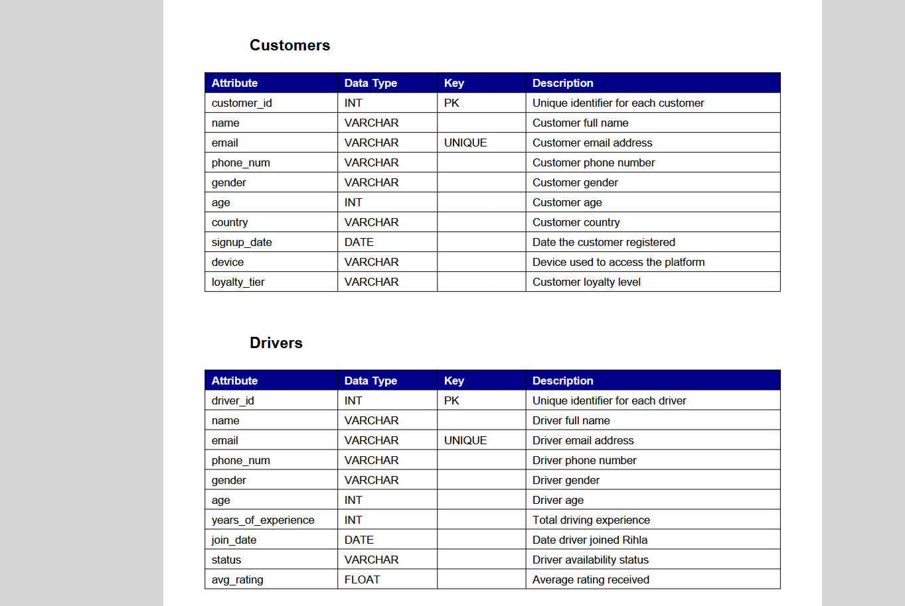

### 📋 Database Entities

| Category | Entities | Description |
|----------|----------|-------------|
| 🚖 **Trips** | Trips, Payment for Trips | Ride-hailing transactions and payments |
| 🚙 **Rentals** | Rent, Payment for Rent | Vehicle rental transactions and payments |
| 📦 **Freight** | Freight, Payment for Freight | Logistics and delivery transactions |
| 👨‍✈️ **Operations** | Drivers, Vehicles, Licenses | Fleet and driver management |
| ⚙️ **Maintenance** | Maintenance, Insurance | Vehicle upkeep and insurance tracking |
| 📝 **Feedback** | Rating, Complaints | Customer satisfaction and issue tracking |

### 🔧 Database Features

- **Stored Procedures**: Add complaints, update trip status, automated workflows
- **Functions**: Calculate trip time, retrieve driver ratings, business logic
- **Triggers**: Prevent invalid data insertion, protect against accidental deletions

---

## 🏢 Data Warehouse Architecture

### Galaxy Schema Design with 5 Fact Tables

## DWH
<!-- ADD YOUR DWH SCREENSHOT HERE -->
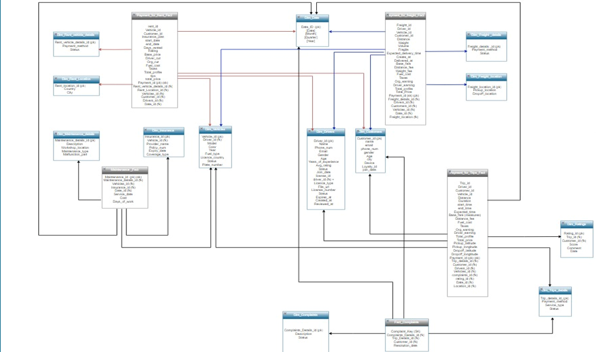

Our data warehouse implements a **Galaxy Schema** architecture optimized for business intelligence and reporting:

1. **Trips Fact Table** - Ride-hailing analytics
2. **Rent Vehicle Fact Table** - Rental performance metrics
3. **Freight Fact Table** - Logistics operations data
4. **Maintenance Fact Table** - Fleet maintenance tracking
5. **Complaints Fact Table** - Customer satisfaction analysis

### Dimension Tables
Connected dimensions include: Date, Time, Customer, Driver, Vehicle, Location, Payment Method, Service Type, and more.

---

## 🔄 ETL Pipeline

<h2>SSIS • SSAS • SSRS</h2>

### 📥 SSIS (SQL Server Integration Services)
<!-- ADD YOUR SSIS SCREENSHOT HERE -->

**Extract, Transform, Load** - Automated data pipelines for:
- Extracting data from operational SQL Server database
- Transforming data according to business rules
- Loading into data warehouse and exporting to Excel

### 📊 SSAS (SQL Server Analysis Services)

Built multidimensional OLAP cubes for advanced analytics:
- **Key Finding**: Electric vehicles (Tesla Model 3) generated highest rental revenue at $17,761
- **Insight**: Luxury models achieved strong profitability through premium pricing
- **Discovery**: Economy cars attracted higher tips, boosting driver earnings

### 📋 SSRS (SQL Server Reporting Services)

Professional operational reports including:
- Daily trip summaries with completion rates and revenue
- Real-time driver performance monitoring
- **Profit & Loss Analysis**: Rentals generated $5.49M organizational profit (4x higher than trips)

---

  
### 🎯 Our Complete Technology Stack

| Layer | Technology | Status | Description |
|-------|------------|--------|-------------|
| 📋 **Requirements** | Business Analysis | ✅ Complete | Comprehensive requirement gathering |
| 🗺️ **ERD Design** | SQL Server | ✅ Complete | Entity Relationship Diagram with 14 entities |
| 🗺️ **Mapping** | SQL Server | ✅ Complete | Table Relations & Foreign Key Constraints |
| 🏗️ **Database Creation** | T-SQL Scripts | ✅ Complete | Full Database Implementation |
| ⚙️ **Stored Procedures** | T-SQL | ✅ Complete | Business Logic & Data Validation |
| 🏢 **Data Warehouse** | SQL Server | ✅ Complete | Galaxy Schema with 5 Fact Tables |
| 🔄 **SSIS Integration** | SQL Server Integration Services | ✅ Complete | Automated ETL Pipelines |
| 📊 **SSAS Cubes** | SQL Server Analysis Services | ✅ Complete | Multidimensional Analysis |
| 📋 **SSRS Reports** | SQL Server Reporting Services | ✅ Complete | Operational Reporting |
| 📊 **Power BI** | Microsoft Power BI | ✅ Complete | Executive & Operational Dashboards |
| 🎨 **Tableau** | Tableau Desktop | ✅ Complete | Interactive Visualizations |
| 📈 **Looker** | Google Looker | ✅ Complete | Embedded Analytics |
| 🐍 **Python Analysis** | Pandas, NumPy, Matplotlib, Seaborn | ✅ Complete | Advanced Statistical Analysis |
| 🌐 **Website** | PHP, HTML, CSS | ✅ Complete | Centralized Dashboard Portal |

---

## 📊 Data Visualization Platforms

### Our Multi-Platform Visualization Approach

### 💼 Power BI Dashboards

**Why Power BI?** Seamless SQL Server integration, robust data modeling, real-time monitoring, and advanced DAX calculations.

#### 📊 Executive Overview Dashboard
- **$10.57M Total Profit** ($1.14M freight + $8.22M rental + $1.21M trips)
- **Volume**: 8K deliveries • 4K rentals • 20K trips
- **Top Performer**: Driver Saeed El Sherbiny with 31 orders
- **VIP Customer**: Samir Abu Fathy with 11 orders

<!-- ADD POWER BI SCREENSHOTS -->
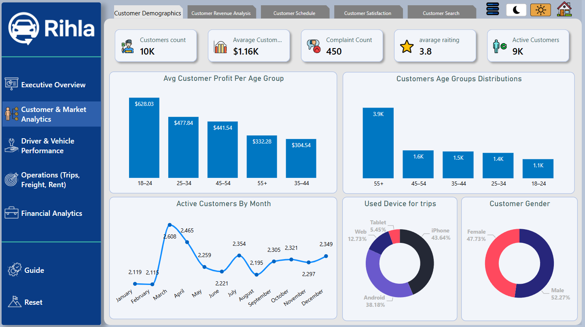
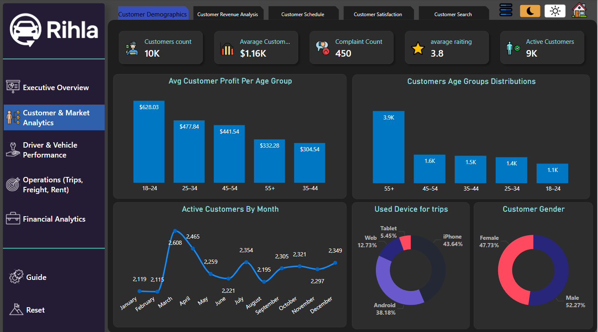

#### 👥 Customer Analytics Dashboard
- **10K customers** with 9K active users
- **$1.16K average customer value**
- **Age 18-24**: Highest profit per customer segment
- **Mobile dominance**: iPhone and Android lead device usage

#### 🚗 Fleet Management Dashboard
- **205 vehicles**: 179 active, 26 in maintenance
- **Average model year**: 2019
- **$71.3K** total maintenance cost
- **Most common**: Nissan Sunny

---

### 🎨 Tableau Dashboards

**Why Tableau?** Industry-leading visualization, highly interactive, aesthetically superior, deep exploratory analysis.

#### 🚖 Trips Dashboard
- **20K trips** • **$4.68M revenue**
- Gender-balanced customer base
- **450 complaints** identified for improvement
- Fuel cost optimization opportunities

<!-- ADD TABLEAU SCREENSHOTS -->
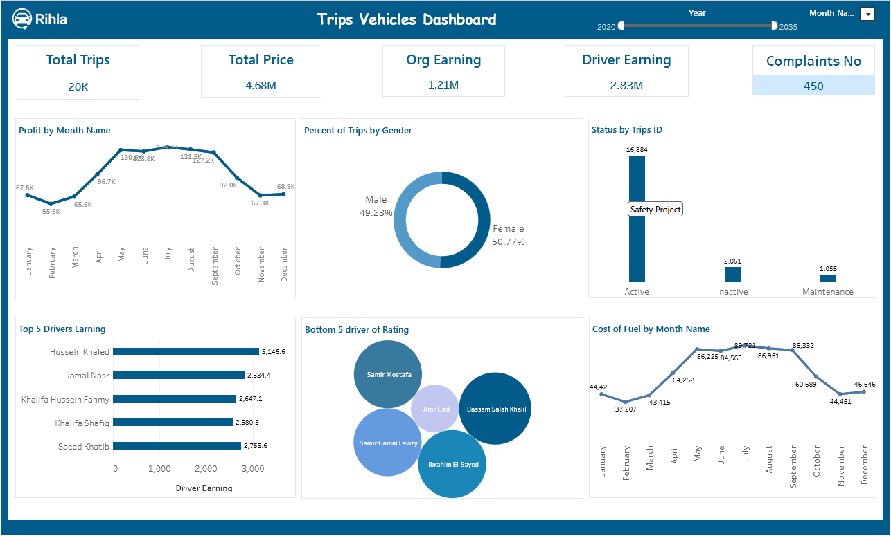
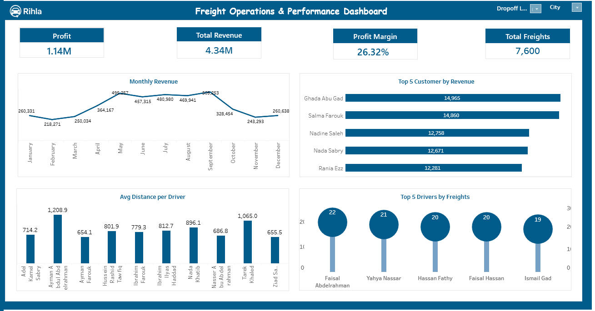

#### 🚙 Rent Dashboard
- **$11.01M revenue** • **$2.90M profit**
- **15 days** average rental duration
- High vehicle utilization variance by model
- Long-term rentals drive higher revenue

#### 📦 Freight Dashboard
- **$1.14M profit** from **$4.34M revenue**
- **26.32% profit margin**
- Monthly revenue peaks mid-year
- Seasonal trends identified

#### 🔧 Maintenance Dashboard
- **Toyota Corolla**: Highest downtime and cost
- Repairs & diagnostics dominate work orders
- Preventive maintenance improvements needed

---

### 📈 Looker Analytics

**Why Looker?** Modern cloud-native platform, embedded analytics, self-service exploration, consistent governed metrics.

#### 🚙 Rent Vehicle Dashboard
- **$31.24M total revenue** from 4,100 rentals
- **$6.22M organizational share** • **$3.84M profit**
- **BMW 5 Series** leads average revenue per model
- Premium models (Mercedes, Chevrolet) top revenue generators

<!-- ADD LOOKER SCREENSHOTS -->
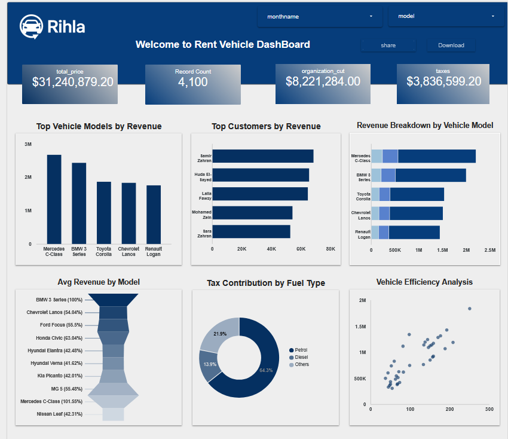

---

### 🐍 Python Analytics

**Why Python?** Advanced statistical modeling, custom analytics, predictive capabilities, unlimited flexibility.

#### 📊 Logistics Operations Dashboard V1
- **$31.24M** rental price • **$9.38M** trip distance cost
- **$4.34M** freight price • **$3.29M** maintenance cost
- Rental prices show normal distribution
- Trip distances predominantly short-range (<50km)

<!-- ADD PYTHON SCREENSHOTS -->
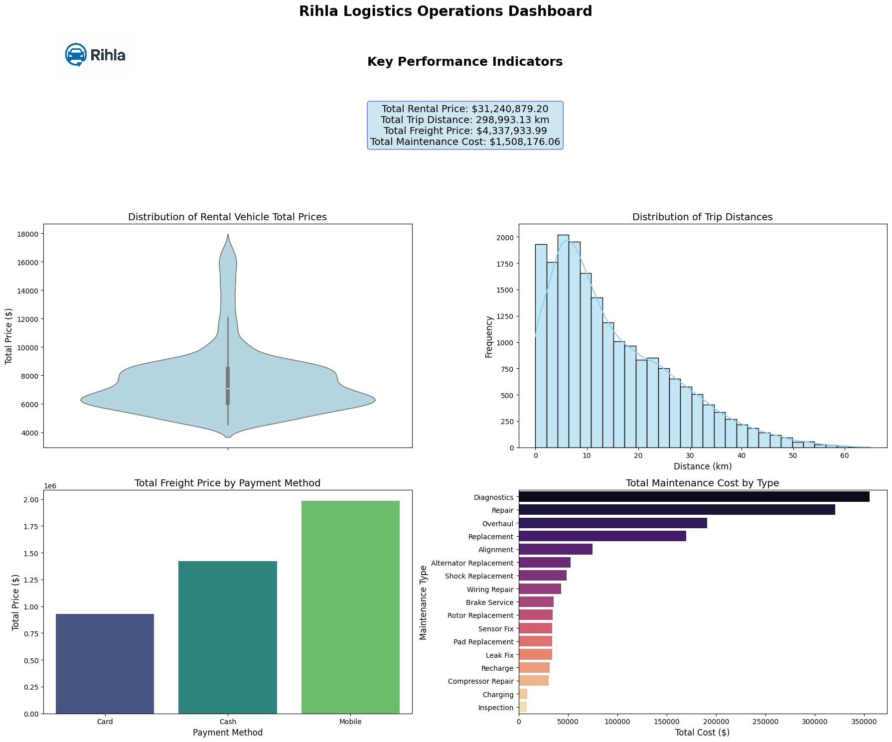

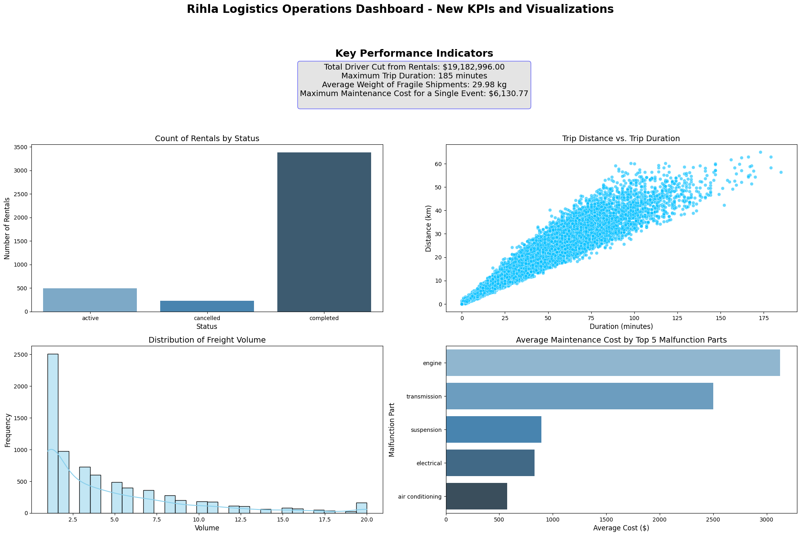

#### 📈 Enhanced KPI Dashboard V2
- **$233.58** average trip price
- **2,696** unique vehicles rented
- **20.89 kg** average freight weight
- **17** distinct maintenance types
- Mobile payments show premium pricing

#### 🎯 Advanced Operations Dashboard V3
- **$15.18M** driver cut from rentals
- **185 minutes** average trip duration
- **29.98 kg** average fragile shipment weight
- **$61,307** maximum single maintenance event
- Strong correlation between distance and duration

---

## 🌐 Website Portal

### 🔗 Live Website
**Visit**: [https://rihla.rf.gd/](https://rihla.rf.gd/)

### ✨ Website Features

- 🔐 **User Authentication System** - Secure login and registration
- 📊 **Centralized Dashboard Portal** - Unified interface for all analytics
- 🎨 **Embedded Visualizations** - Power BI, Tableau, Looker, and Python charts
- ⚡ **Real-time Data Access** - Live connection to data warehouse
- 📱 **Responsive Design** - Optimized for all devices

<!-- ADD WEBSITE SCREENSHOTS -->
## Website

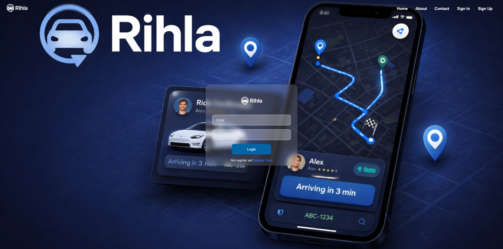
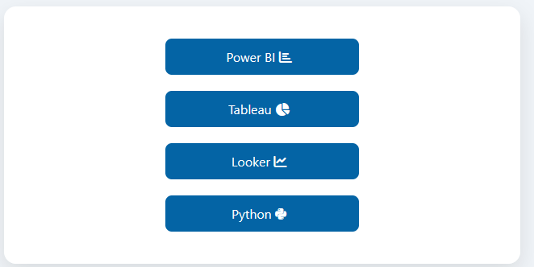
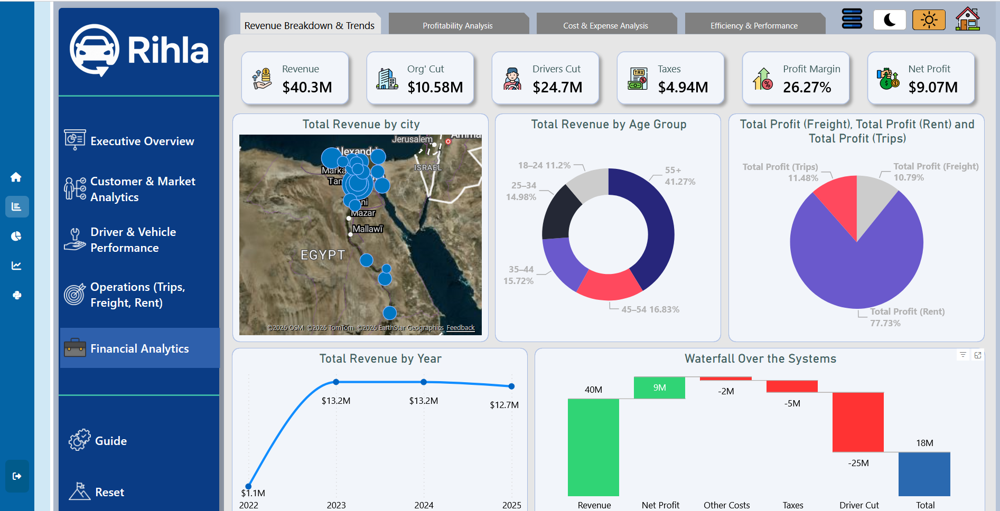

---

## 💡 Key Insights & Recommendations

### 📈 Revenue Analysis

| Insight | Finding | Action |
|---------|---------|--------|
| 💰 **Most Profitable** | Rentals generate 77.73% of revenue | Focus marketing on rental services |
| 👥 **Best Demographic** | Age 18-24 contributes 41.27% | Target youth with specific campaigns |
| 💳 **Payment Leader** | Mobile payments at 45% | Invest in mobile payment infrastructure |

### 🎯 Strategic Recommendations

1. **🚗 Optimize Fleet Mix**: Focus on high-performers like BMW 5 Series and Tesla Model 3
2. **🔧 Preventive Maintenance**: Reduce Toyota Corolla downtime with better scheduling
3. **📅 Promote Long Rentals**: Incentivize 15+ day rentals for maximum profit
4. **🎓 Target Youth**: Expand marketing to 18-24 age group (highest ROI)
5. **⭐ Share Best Practices**: Replicate success of top driver Saeed El Sherbiny
6. **📞 Resolve Complaints**: Address 450 identified issues to boost satisfaction
7. **⛽ Cut Fuel Costs**: Implement route optimization algorithms
8. **📱 Mobile First**: Enhance mobile app experience (45% of payments)

### 📊 Service-Specific Performance

- **🚖 Trips**: Highest volume but lower margins due to driver payouts
- **🚙 Rentals**: Most profitable with 4x higher organizational profit than trips
- **📦 Freight**: Needs efficiency improvements to boost profitability

---

## 🔮 Future Enhancements

### 🎯 Planned Features

- 🤖 **Machine Learning**: Predictive demand forecasting and dynamic pricing
- ⚡ **Real-time Analytics**: Stream processing for live updates
- 📱 **Mobile Apps**: Native iOS and Android applications
- 🗺️ **Route Optimization**: AI-powered routing algorithms
- 🎁 **Loyalty Program**: Data-driven customer rewards
- 🔧 **Predictive Maintenance**: ML-based vehicle maintenance scheduling
- 💳 **Payment Expansion**: More digital wallets and payment gateways
- 🌍 **Internationalization**: Multi-language support

### 🛠️ Technical Improvements

- ☁️ Cloud migration (Azure/AWS)
- 🔄 CI/CD pipelines
- 🔒 Enhanced security & encryption
- 🔌 REST API development
- 🔁 Real-time data sync

---

## ⭐ Meet Our Team

<h2>🔥 The Legendary Team 🔥</h2>

<table>
<tr>

<!-- Mohamed Weshahy -->
<td align="center">

 
<b>⚡ Mohamed Weshahy</b>
 
Data Analyst & BI Developer

 

 

</td>

<!-- Ahmed Ashraf -->
<td align="center">

 
<b>🔥 Ahmed Ashraf</b>
 
Data Analyst & BI Developer

 

 

</td>

<!-- Asmaa Salah -->
<td align="center">

 
<b>💎 Asmaa Salah</b>
 
Data Analyst & BI Developer

 

 

</td>

<!-- Ahmed Hamdan -->
<td align="center">

 
<b>🎯 Ahmed Hamdan</b>
 
Data Analyst & BI Developer

 

 

</td>

</tr>
</table>

 

